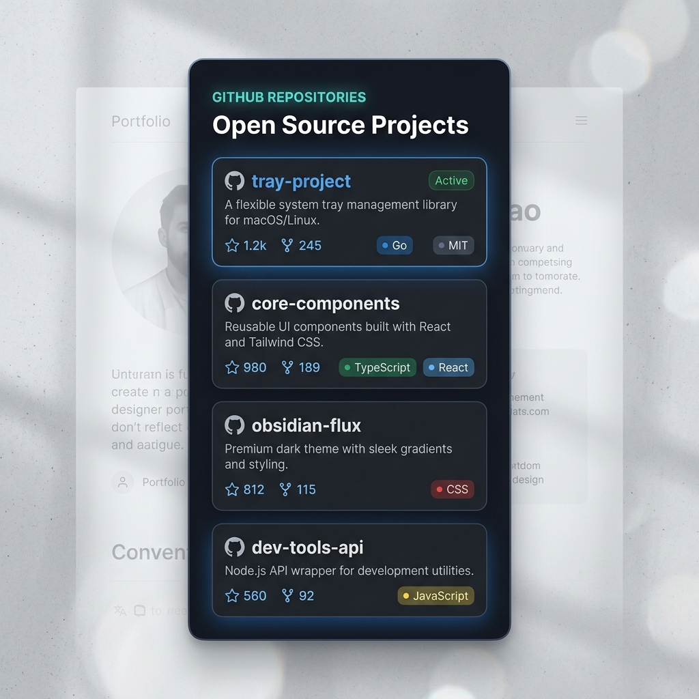

# GitHubProjectTray 🚀

A premium, fully responsive, zero-cost, embeddable **GitHub Repository Showcase Widget** designed to showcase your open-source projects beautifully on personal portfolios, developer blogs, and personal websites.

Built with **Vite, React, TypeScript, and Tailwind CSS v4**.

---

## 📸 Preview Mockup



---

## ✨ Features

- **Zero-Cost & Serverless**: Runs completely in the visitor's browser (client-side) using GitHub's public unauthenticated API. No API tokens, database setup, or server costs.
- **Isolated Rate Limits**: API queries count against the visitor's own IP address pool (60 requests/hour), preventing hosting-wide blocks.
- **Dynamic Configurator**: Enter a username to preview the showcase list, toggle preview themes, and copy the auto-generated iframe snippet.
- **Highly Customisable URL Parameters**:
  - `?user=username`: Triggers **Widget Mode**, hiding configurator menus and showing a clean, iframe-friendly list.
  - `?theme=light|dark`: Forces light or dark mode styling.
  - `?layout=list|grid`: Switches between list layout (single-column) or responsive grid layout (two-columns).
  - `?limit=6|max`: Limits the count of displayed repositories (or `max` to list all).
  - `?sort=stars|issues|name`: Sets the default sorting order.
- **Interactive Search & Filters**: Keeps search bar input, language, and sorting selectors active *inside the widget* so visitors can interact with your portfolio live!

---

## 🚀 How to Embed in Your Portfolio

Customize and copy the snippet directly from the hosted configurator dashboard, or write it manually:

```html
<iframe 
  src="https://GarvitOfficial.github.io/githubProjectTray/?user=GarvitOfficial&theme=dark&layout=grid&limit=max&sort=stars" 
  width="100%" 
  height="500" 
  style="border: none; border-radius: 8px; background: transparent;" 
  loading="lazy"
></iframe>
```


## 📄 License

This project is open-source and available under the [MIT License](LICENSE).
